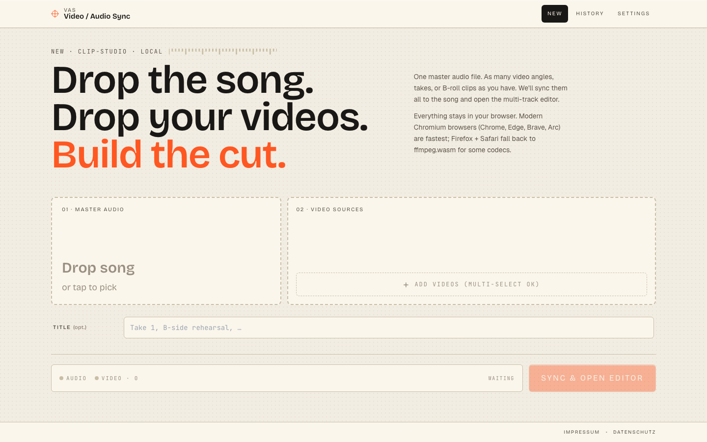
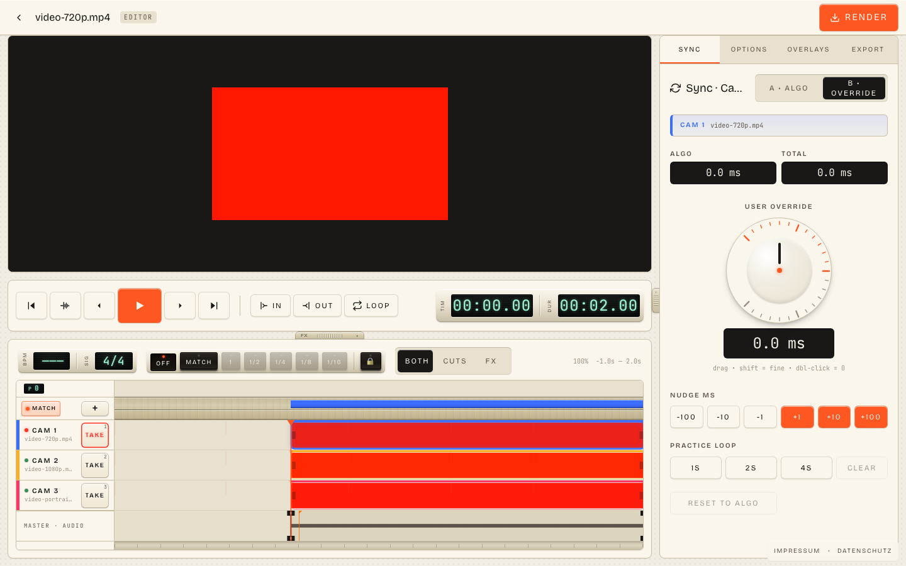
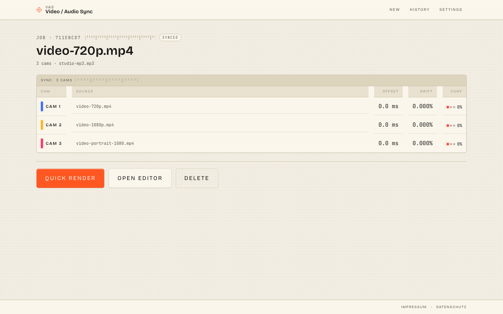
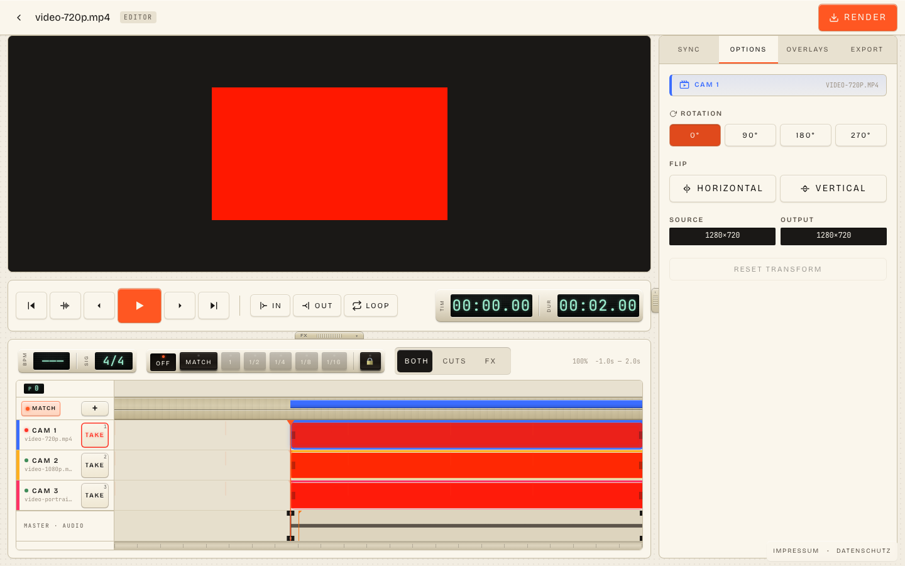
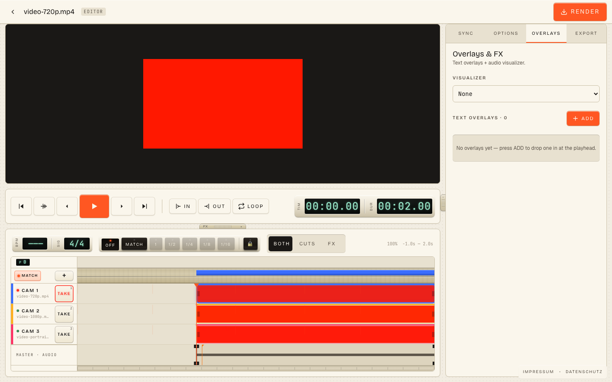
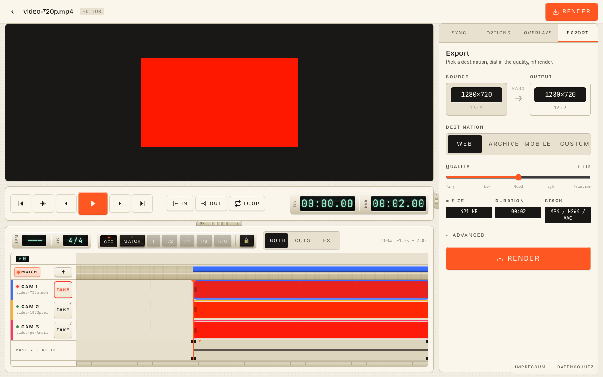
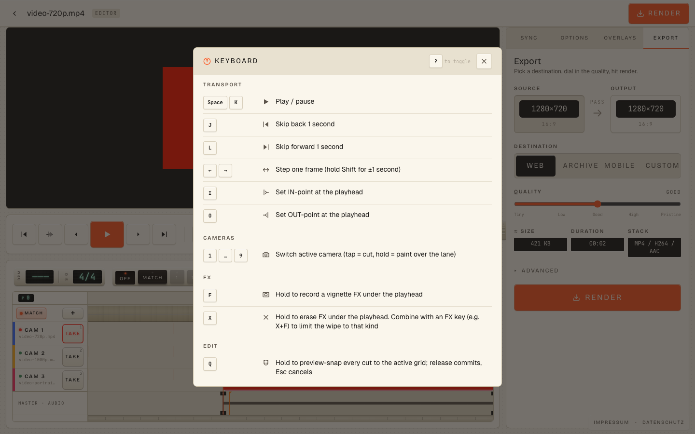

# Video / Audio Sync

A small, opinionated video editor for musicians who want to ship a clip,
not learn an NLE.

You record yourself playing the song on your phone (or your Ray-Bans, or three
phones on tripods, or whatever) and you also have the clean studio render of
the song as MP3/WAV. Drop both in the browser. The app aligns every camera
angle to the studio audio, opens a multi-track editor, and renders an MP4 you
can post.

No upload, no account, no waiting room. Everything happens in the browser tab
in front of you.

**Live demo:** <https://sync.johannboehme.de>

<p align="center">
  
</p>

## The shortcut

Most "shortform video tools" are timeline editors with a phone preset. Most
"pro NLEs" are a six-pane workspace, a project file, an asset bin, and a
render queue between you and a 22-second clip. This is the bit between those
two: a fixed workflow for one specific job — *"that song, those phone takes,
one finished video"* — with the boring parts removed.

If you've ever tried to nudge a phone-mic recording onto a studio mix by ear,
or sat in front of three takes wondering which one had the cleanest first
chorus, this is built for you.

## What makes it interesting

### 1. Auto-sync that actually works

Drop the studio audio + however many video angles you have. The app pulls
12-bin chroma features out of the phone audio and the studio audio,
cross-correlates them, runs a sliding-window drift refinement on top, and
falls back to chroma-DTW when confidence is low. Each cam ends up with an
algorithmic offset and a confidence number. Bad takes are flagged; good takes
are usable on the first try.

Written in Rust, compiled to WASM, runs inside the page. ~16 cargo tests on
the algorithm itself, plus end-to-end tests in real Chromium.

### 2. Match-snap (the killer feature)

Beat detection runs on the master audio and you get a real beat grid: 4/4 by
default, configurable to anything else, with a bar-1 pickup so the grid lines
up with the *song* and not with sample 0.

When you drag a video clip on the timeline, you can snap it to:

- **Off** — free drag.
- **A grid step** — 1, 1/2, 1/4, 1/8, 1/16 of a beat.
- **Match** — a generated set of *audio-match positions*. The app figures out
  the moments inside the clip where its audio would line up with a downbeat
  in the master, and snaps to *those*. So you're not snapping to "the nearest
  beat"; you're snapping to "the place where the take actually plays the
  downbeat."

Hold `Q` to live-preview the whole timeline quantized to the active grid;
release to commit, `Esc` to cancel. You can re-time a whole edit in about a
second.

<p align="center">
  
</p>

### 3. The editor is shaped like the job

Every panel and control is something this specific workflow needs. There is no
asset bin, no scopes, no nested timelines, no "create a sequence." There is a
**MASTER · AUDIO** track at the bottom and one lane per cam above it, each
with its full clip painted in. You can:

- **Cut between cams** by tapping `1`–`9` (number = cam, current playhead
  position = cut). Hold a number to "paint" that cam over a stretch.
- **Trim** clip edges or split with the eraser-head; both edges produce real
  cuts, no ghost media.
- **Drop a vignette FX** by holding `F`; the FX has its own in/out points and
  multiple FX can overlap.
- **Drag clips around** with snapping you can actually trust (see above).
- **Set practice loops** — 1 s / 2 s / 4 s loops around the playhead — to
  audition cuts before you commit.

### 4. Browser is the runtime

WebCodecs does the heavy lifting. ffmpeg.wasm is in the back of the cupboard
for codecs WebCodecs doesn't reach. OPFS holds the raw media; IndexedDB holds
the edit spec. There is no server-side state — closing the tab takes nothing
with it, and re-opening picks the project back up.

The render path is two-stage:

- **Quick render** — re-mux your phone video with the studio audio at the
  computed offset. Seconds, not minutes.
- **Edit render** — decode → composite (cuts, FX, text, audio-viz) → encode.
  WebGL2 if your browser has it, Canvas2D fallback if it doesn't. About
  realtime on a recent laptop.

## Workflow, in pictures

**1. Drop everything in.** One master audio, one or more videos. No project
files, no settings dialog.

<p align="center">
  
</p>

**2. Sync runs.** Each cam gets an offset and a confidence number. From the
job page you can hit *Quick render* to ship a single-angle video right now,
or *Open editor* to multi-cam.

<p align="center">
  
</p>

**3. Cut the edit.** SYNC tab keeps the algorithmic alignment + a fine-tune
knob with millisecond nudge buttons; the timeline below has the master audio
waveform, the cam lanes, the beat grid, the snap controls, the program-strip
mode picker (`BOTH` / `CUTS` / `FX`) and the FX rail.

<p align="center">
  
</p>

**4. Per-clip options.** 90°/180°/270° rotation (so the portrait phone clip
plays right-side up next to the landscape one), horizontal/vertical flip,
source vs. output resolution readout. The output frame is the bbox of every
active cam — no master, no padding, no setting to forget.

<p align="center">
  
</p>

**5. Overlays.** Audio-reactive visualizers (showwaves, showfreqs, etc.)
plus text overlays rendered through a Canvas2D ASS-subset engine — same
font, same positioning, same fades you'd write in a `.ass` file, but applied
inline.

<p align="center">
  
</p>

**6. Render.** Pick a destination preset (Web / Archive / Mobile / Custom),
slide a single quality slider, hit *Render*. Live size estimate; live
duration; live codec readout.

<p align="center">
  
</p>

**7. Tap `?` for the cheat sheet.** Every keyboard shortcut in the app
auto-registers itself in the overlay, so the list never lies to you.

<p align="center">
  
</p>

## Full feature list

**Sync**
- Chroma cross-correlation (Rust → WASM) with chroma-DTW fallback
- Sliding-window drift refinement (handles takes that are slightly long or
  short relative to the master)
- Per-cam confidence reporting
- User-override knob on top of the algorithmic offset, with `±1` to `±100` ms
  nudge buttons

**Editor — timeline**
- Multi-cam lanes, one per cam, with full waveform paint
- BPM detection + time-signature picker + bar-1 pickup nudge
- Snap modes: `off`, `match`, `1`, `1/2`, `1/4`, `1/8`, `1/16`
- Match-snap with generated audio-match positions per clip
- Quantize-preview hold (`Q`) — see the whole timeline snapped before you
  commit; `Esc` cancels
- Cuts as exclusive cam switches; tap a number = cut, hold = paint
- Punch-in FX (currently: vignette) that overlap freely on a separate FX rail
- Trim from both edges and split via the eraser-head — true cuts, no ghost
  media
- Per-clip rotation (0/90/180/270°) and flip (H/V)
- Practice-loop buttons (1 s / 2 s / 4 s) around the playhead
- Brass-plate LCD transport clock + mechanical-keycap shortcut overlay (`?`)

**Editor — overlays & FX**
- Audio-reactive visualizers (showwaves, showfreqs, …)
- Text overlays via a Canvas2D ASS-subset renderer
- Live preview of overlays in the canvas; same code paints the final render

**Editor — output**
- Output frame = bbox of all active clips. No master video, no padding pass.
- Destination presets: Web, Archive, Mobile, Custom
- Single quality slider drives bitrate; live size estimate, duration readout,
  codec readout
- Two render paths: quick (re-mux audio) and edit (full composite +
  re-encode)
- WebGL2 compositor with Canvas2D fallback

**Storage & state**
- OPFS for raw media (no upload, ever)
- IndexedDB for job metadata and edit specs
- Auto-persist on every edit; reload picks up where you left off
- Job history page; per-job delete (the trash icon erases everything)

**Browser & infra**
- Chrome / Edge / Brave / Arc — fully native via WebCodecs
- Firefox / Safari — falls back to ffmpeg.wasm where needed
- Cross-origin-isolated (COOP/COEP) for SharedArrayBuffer + threaded codecs
- Browser capability report on `/settings` so you can see what path each
  feature takes

## Privacy

There is no backend. The host nginx terminates TLS, the container's nginx
serves the static SPA bundle, and that's the entire server. Phone video,
studio audio, and edits all live in your browser's OPFS + IndexedDB. To wipe
a job, click its trash icon — there is nothing to delete server-side.

No analytics. No cookies. No fonts loaded from third-party CDNs (the
`@fontsource-variable/*` packages bundle them locally).

## Local development

```bash
cd frontend
npm install --legacy-peer-deps
npm run dev               # http://localhost:5173 with COOP/COEP headers
```

Production bundle:

```bash
cd frontend
npm run build             # → dist/
npm run preview           # serve dist/
```

You need:

- Node 20+
- Rust stable + `wasm32-unknown-unknown` target + `wasm-pack`
- A modern Chromium (Chrome / Edge / Brave / Arc) for the browser tests

## Tests

Three test runners; see [TESTING.md](TESTING.md) for the full strategy:

```bash
cd frontend
npm run test              # vitest in jsdom (pure functions, components)
npm run test:browser      # vitest in real Chromium via Playwright
npm run wasm:test         # cargo test on the Rust sync-core
```

Current totals: 469 unit tests, 20 browser-test files (real Chromium with
WebCodecs + OPFS + ffmpeg.wasm + end-to-end render + ASS overlay
verification), and 23 cargo tests on the sync algorithm.

## Architecture

```
Browser (everything runs here)
├── Sync algorithm        Rust → WASM (frontend/wasm/sync-core)
├── Codec layer           WebCodecs primary, ffmpeg.wasm fallback
│                         (frontend/src/local/codec/)
├── Render
│   ├── Quick (audio re-encode + video pass-through)
│   └── Edit  (decoder → compositor → encoder)
├── Subtitle burn-in      Custom Canvas2D ASS-subset renderer
│                         (frontend/src/local/render/ass-renderer.ts)
├── Visualizers           showwaves, showfreqs, …
│                         (frontend/src/local/render/visualizer/)
├── Storage
│   ├── OPFS              Raw video, raw audio, render output
│   └── IndexedDB         Job metadata, sync results, edit specs
└── UI                    React + Zustand + Canvas timeline

Server (just hosting)
└── nginx + static SPA bundle (Dockerfile + deploy/nginx.conf)
```

## Production deployment

The container is two stages: build the React app + the Rust→WASM core, then
serve `dist/` from `nginx:1.27-alpine` with COOP/COEP set in
[`deploy/nginx.conf`](deploy/nginx.conf).

Bootstrap on a fresh server (Debian / Ubuntu):

```bash
sudo apt-get update && sudo apt-get install -y \
  docker.io docker-compose-plugin nginx certbot python3-certbot-nginx
git clone https://github.com/<you>/videoaudiosync.git ~/videoaudiosync
cd ~/videoaudiosync
sudo cp deploy/nginx-vhost.conf /etc/nginx/sites-available/<your-host>
sudo ln -s /etc/nginx/sites-available/<your-host> /etc/nginx/sites-enabled/
sudo certbot --nginx -d <your-host>
docker compose up -d --build
```

Continuous deployment: run [`deploy/deploy.sh`](deploy/deploy.sh) from a cron
or push hook on the server. It pulls main, rebuilds the image, rolls the
container, and rolls back on a failed readiness check.

**Updating** is `git pull && docker compose up -d --build`.

**Cross-origin isolation**: if `crossOriginIsolated === false` in the page
console, check that both the host nginx vhost and the container's
`nginx.conf` keep `Cross-Origin-Opener-Policy: same-origin` and
`Cross-Origin-Embedder-Policy: require-corp` intact.

## Hosting in Germany — compliance checklist

The published instance ships with what a private, non-commercial tool in DE
typically needs. If you fork and host your own:

- **Edit the imprint** — [`frontend/src/pages/Impressum.tsx`](frontend/src/pages/Impressum.tsx)
  hardcodes the operator's name, postal address and e-mail. Replace before
  deploying. The address must be capable of receiving registered mail.
- **Update the supervisory authority** in
  [`frontend/src/pages/Datenschutz.tsx`](frontend/src/pages/Datenschutz.tsx)
  to the data-protection authority of *your* federal state if you're not in
  Bavaria.
- **Anonymise nginx logs.** [`deploy/nginx-vhost.conf`](deploy/nginx-vhost.conf)
  enables an `anon` log format; the matching `map` and `log_format` directives
  must live at `http {}` scope in the host `/etc/nginx/nginx.conf` — see the
  comment block at the top of the vhost file.
- **Log retention** — `/etc/logrotate.d/nginx` already rotates
  `/var/log/nginx/*.log` daily with `rotate 14`, so the access log drops
  after 14 days. The privacy policy mirrors that number; if you change
  retention, update `Datenschutz.tsx`.
- **Web fonts are bundled locally** via `@fontsource-variable/*` — do not
  re-introduce a `fonts.googleapis.com` import.
- **No analytics, no tracking, no cookies.** Keep it that way; if you add
  any, the privacy policy must change accordingly.

Not legal advice. For a forked deployment that goes beyond a personal hobby
project, have a lawyer review the imprint and privacy policy texts.

## License

[MIT](LICENSE) — do whatever, no warranty.

The browser-side ffmpeg.wasm fallback is loaded under LGPL v2.1+
(<https://ffmpeg.org>, <https://github.com/ffmpegwasm/ffmpeg.wasm>); the
unmodified source is available at those upstream links.

## Acknowledgments

The visual language is unapologetically inspired by Teenage Engineering — the
brass-plate LCDs, the chunky buttons, the workflow built around a single
dedicated job rather than infinite configurability. If you've ever bounced a
take through an OP-1, you'll feel at home.
